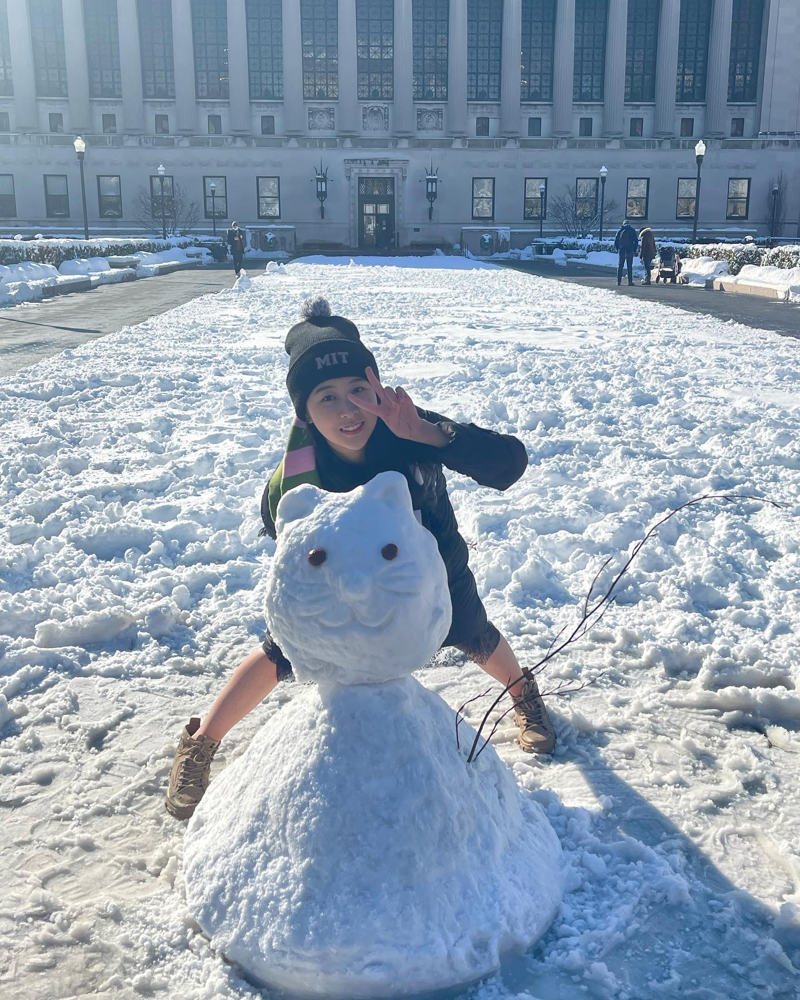

<h1 align="center">Hi there </h1>

I'm Angel (Leyi) Cui

<a href="https://www.cs.cmu.edu/">@Carnegie Mellon University</a>

 First-year PhD student in Software Engineering

<a href="https://columbia.edu/">@Columbia University</a> Class of 2025

 M.S. in Computer Science

<a href="https://barnard.edu/">@Barnard College of Columbia University</a> Class of 2023.5

 B.A. in Computer Science; Minor in Dance

  

- 🔭 Most of my previous work is done in the field of program synthesis under Prof. Mark Santolucito, software robustness and formal methods with Prof. Eunsuk Kang, and LLM code generation with Prof. Baishakhi Ray and Prof. Junfeng Yang.
- 👯 I’m looking to collaborate on Formal Methods, Software Engineering, and Artificial Intelligence projects
- 💬 Ask me about my research.
- 😄 Pronouns: she/her/hers
- ⚡ Fun fact: My favorite place to go in New York so far is *Lincoln Center*

---

### Learn More About Me

<h3>Contact Me</h3>

